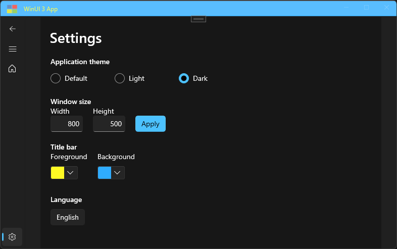

# 📒WinUI 3 App Project Templates Extension

## 📝Project Templates

This extension installs 3 types of project templates to Visual Studio 2022.

### Blank app project template

- Nullable enabled
- Redundant code removed
- No sample button

### Basic app project template

- Based on _Blank app_ project template
- MVVM
- Dependency injection
- App activation
- Settings
- Windowing
- Title bar
- Theme
- Localization

### Navigation app project template

- Based on _Basic app_ project template
- Navigation
- Settings page

<figcaption>Navigation app Settings page</figcaption>

## 📦NuGet packages

- CommunityToolkit.MVVM
- CommunityToolkit.WinUI
- CommunityToolkit.WinUI.UI.Controls
- Microsoft.Extensions.Hosting

## 🎬YouTube
Playlist: 
https://www.youtube.com/playlist?list=PLWyJQIhN3vyOjJAdrURtKL7zDHFojN1sD
Part 1: Blank App | VSIX
https://www.youtube.com/watch?v=Z7mA8wCXWWI&t=256s
Part 2: Basic App | Navigation App | Visual Studio Marketplace
https://www.youtube.com/watch?v=nKguHB3LD9A
